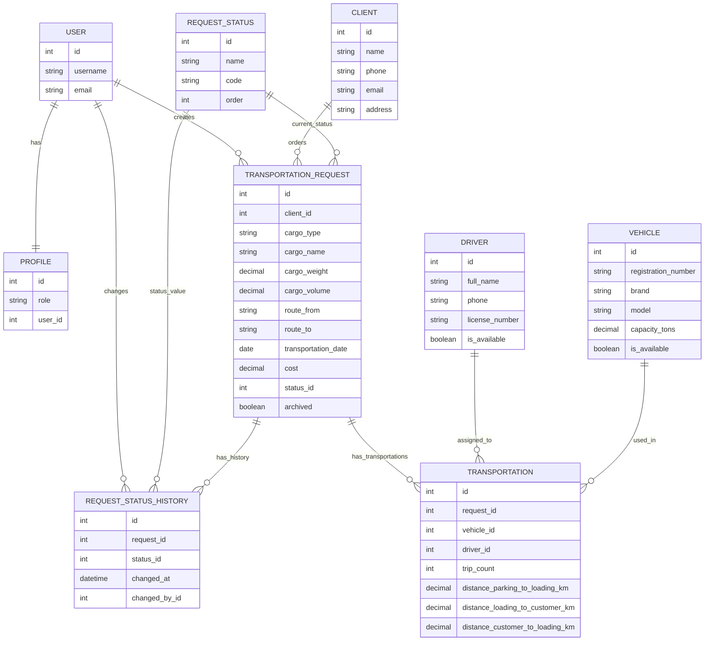

# 07. Модель данных

## Основные сущности

### User

Стандартная сущность Django `auth.User`. Используется для авторизации и связи с профилем пользователя.

Ключевые поля:

- username;
- password;
- email;
- is_staff;
- is_superuser.

### Profile

Профиль пользователя системы.

Ключевые поля:

- user;
- role.

Роли:

- manager;
- leader;
- admin.

### Client

Клиент, который заказывает перевозку.

Ключевые поля:

- name;
- phone;
- email;
- address;
- notes.

### Driver

Водитель, который может быть назначен на перевозку.

Ключевые поля:

- full_name;
- phone;
- license_number;
- is_available;
- notes.

### Vehicle

Транспортное средство.

Ключевые поля:

- registration_number;
- brand;
- model;
- capacity_tons;
- is_available;
- notes.

### RequestStatus

Справочник статусов заявки.

Ключевые поля:

- name;
- code;
- order.

Примеры статусов:

- new;
- processing;
- assigned;
- in_progress;
- completed;
- cancelled.

### TransportationRequest

Заявка на перевозку.

Ключевые поля:

- client;
- cargo_type;
- cargo_name;
- cargo_weight;
- cargo_volume;
- route_from;
- route_to;
- transportation_date;
- cost;
- status;
- comment;
- archived;
- created_by.

Расчетные методы:

- calculate_cargo_cost();
- calculate_distance_cost();
- calculate_cost();
- assigned_capacity_tons();
- total_distance_km().

### RequestStatusHistory

История изменения статусов заявки.

Ключевые поля:

- request;
- status;
- changed_at;
- changed_by.

### Transportation

Назначенная перевозка внутри заявки. На одну заявку может быть назначено несколько перевозок, то есть несколько ТС.

Ключевые поля:

- request;
- vehicle;
- driver;
- assigned_at;
- departure_at;
- arrival_at;
- trip_count;
- distance_parking_to_loading_km;
- distance_loading_to_customer_km;
- distance_customer_to_loading_km;
- notes.

Расчетные поля:

- total_distance_km;
- distance_cost;
- required_trip_count;
- total_capacity_tons;
- load_percent.

## Связи

| Сущность 1 | Тип связи | Сущность 2 | Описание |
|---|---|---|---|
| User | 1:1 | Profile | У пользователя есть профиль |
| Client | 1:N | TransportationRequest | Клиент может иметь много заявок |
| RequestStatus | 1:N | TransportationRequest | Статус используется в заявках |
| TransportationRequest | 1:N | RequestStatusHistory | У заявки есть история статусов |
| User | 1:N | TransportationRequest | Пользователь может создать много заявок |
| User | 1:N | RequestStatusHistory | Пользователь может изменить много статусов |
| TransportationRequest | 1:N | Transportation | На одну заявку можно назначить несколько ТС |
| Vehicle | 1:N | Transportation | ТС может участвовать во многих перевозках во времени |
| Driver | 1:N | Transportation | Водитель может участвовать во многих перевозках во времени |

## Mermaid ER-диаграмма

## Комментарий аналитика

Ключевое изменение модели — переход от одной перевозки на заявку к нескольким перевозкам на одну заявку. Это позволяет моделировать реальные ситуации, когда один заказ выполняется несколькими ТС или несколькими рейсами.
