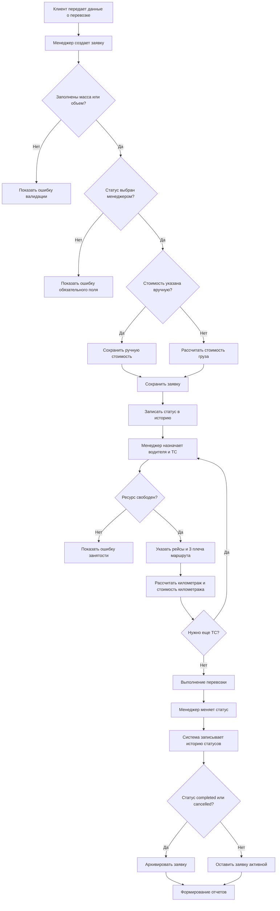

# 09. BPMN и процессы

## AS-IS процесс

AS-IS описывает ситуацию до внедрения единой системы.

1. Клиент обращается к менеджеру.
2. Менеджер вручную записывает данные клиента и груза.
3. Менеджер уточняет доступность водителей и транспорта по звонкам или таблицам.
4. Менеджер вручную считает стоимость.
5. Менеджер назначает водителя и ТС.
6. Статус заявки фиксируется вручную.
7. При изменениях менеджер обновляет таблицы или документы.
8. Отчетность собирается вручную.

Проблемы AS-IS:

- нет единого источника данных;
- нет автоматической проверки занятости;
- нет истории изменения статусов;
- стоимость зависит от ручного расчета;
- сложно собрать отчет за период;
- высокая вероятность ошибки при назначении ресурсов.

## TO-BE процесс

TO-BE описывает процесс после внедрения системы.

1. Менеджер авторизуется.
2. Менеджер создает заявку.
3. Менеджер выбирает обязательный статус.
4. Система проверяет массу или объем.
5. Система рассчитывает стоимость, если она не введена вручную.
6. Менеджер назначает одно или несколько ТС и водителей.
7. Система проверяет занятость ресурсов.
8. Система рассчитывает километраж и транспортную часть стоимости.
9. Менеджер обновляет статус заявки.
10. Система фиксирует историю статусов.
11. При completed или cancelled заявка архивируется.
12. Пользователь формирует отчет и экспортирует его в PDF или Excel.

Преимущества TO-BE:

- единый реестр заявок;
- прозрачная история статусов;
- автоматический расчет стоимости;
- контроль занятости водителей и ТС;
- поддержка нескольких ТС на одну заявку;
- быстрые отчеты и экспорт.

## Mermaid flowchart

## BPMN-описание в текстовом виде

| Этап | Участник | Действие | Результат |
|---|---|---|---|
| 1 | Клиент | Передает заявку | Менеджер получает исходные данные |
| 2 | Менеджер | Создает заявку | Заявка появляется в системе |
| 3 | Система | Проверяет обязательные поля | Ошибка или сохранение |
| 4 | Система | Рассчитывает стоимость | Заполнено поле стоимости |
| 5 | Менеджер | Назначает ТС и водителя | Создается перевозка |
| 6 | Система | Проверяет занятость | Ошибка или назначение |
| 7 | Система | Считает километраж | Обновляется стоимость |
| 8 | Менеджер | Меняет статус | Статус обновлен |
| 9 | Система | Пишет историю | Есть аудит изменений |
| 10 | Система | Архивирует закрытые заявки | Заявка уходит в архив |
| 11 | Руководитель | Формирует отчет | Получает аналитику |
